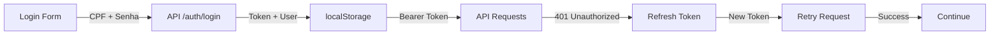

# 🔗 Integração Frontend-Backend

## Configuração Necessária

### 1. Variáveis de Ambiente Frontend

Crie um arquivo `.env.local` na pasta `frontend/`:

```env
NEXT_PUBLIC_API_URL=http://localhost:8080/api
```

Para produção:
```env
NEXT_PUBLIC_API_URL=https://sua-api-em-producao.com/api
```

### 2. CORS no Backend (Spring Boot)

O backend deve permitir requisições do frontend. Configure em `application.properties`:

```properties
# CORS Configuration
cors.allowed-origins=http://localhost:3000,http://localhost:3001
cors.allowed-methods=GET,POST,PUT,DELETE,OPTIONS
cors.allowed-headers=*
cors.allow-credentials=true
```

Ou implemente uma classe de configuração:

```java
@Configuration
public class CorsConfig implements WebMvcConfigurer {
    @Override
    public void addCorsMappings(CorsRegistry registry) {
        registry.addMapping("/api/**")
            .allowedOrigins("http://localhost:3000")
            .allowedMethods("GET", "POST", "PUT", "DELETE")
            .allowedHeaders("*")
            .allowCredentials(true)
            .maxAge(3600);
    }
}
```

### 3. Endpoints Necessários da API

O backend deve implementar os seguintes endpoints:

#### **Auth Endpoints**
- `POST /api/auth/login` - Login com CPF e senha
- `POST /api/auth/logout` - Logout
- `POST /api/auth/refresh` - Renovar token JWT
- `GET /api/auth/me` - Obter dados do usuário atual

#### **Student Endpoints**
- `GET /api/students/{id}` - Obter perfil do aluno
- `PUT /api/students/{id}` - Atualizar perfil
- `GET /api/students/{id}/progress` - Obter progresso dos módulos
- `POST /api/students/{id}/progress` - Atualizar progresso
- `GET /api/students/{id}/lessons-completed` - Listar aulas completadas
- `POST /api/students/{id}/lessons/{lessonId}/complete` - Marcar aula como completa

#### **Module Endpoints**
- `GET /api/modules` - Listar todos os módulos
- `GET /api/modules/{id}` - Obter módulo específico
- `GET /api/modules/{id}/lessons` - Listar aulas do módulo

### 4. Resposta de Login Esperada

```json
{
  "accessToken": "eyJhbGciOiJIUzI1NiIs...",
  "refreshToken": "eyJhbGciOiJIUzI1NiIs...",
  "student": {
    "id": 1,
    "name": "João Silva",
    "email": "joao@example.com",
    "cpf": "02398304310",
    "phase": "Iniciante",
    "progress": 25,
    "streak": 5,
    "xp": 1250,
    "modulesCompleted": 3,
    "lastAccess": "2024-12-25T10:30:00Z",
    "createdAt": "2024-01-15T08:00:00Z",
    "updatedAt": "2024-12-25T10:30:00Z"
  }
}
```

### 5. Estrutura de JWT (Token)

O token deve conter as seguintes claims:

```json
{
  "sub": "user_id",
  "name": "João Silva",
  "email": "joao@example.com",
  "cpf": "02398304310",
  "iat": 1703502600,
  "exp": 1703589000
}
```

## Fluxo de Autenticação



## Hooks e Context Disponíveis

### `useAuth()`

```tsx
import { useAuth } from "@/context/AuthContext";

function MyComponent() {
  const { student, isAuthenticated, logout } = useAuth();
  
  if (!isAuthenticated) return <LoginForm />;
  
  return <div>Olá, {student?.name}!</div>;
}
```

### `useStudentData()`

```tsx
import { useStudentData } from "@/hooks/useStudentData";

function ProgressDisplay() {
  const { student, progress, refetch } = useStudentData({
    studentId: 1,
    autoRefresh: true,
    refreshInterval: 30000
  });
  
  return <div>Progresso: {progress}%</div>;
}
```

## Segurança

- ✅ Tokens armazenados em `localStorage`
- ✅ Auto-refresh de tokens expirados
- ✅ Logout automático em erro 401
- ✅ CORS configurado
- ✅ Interceptores de requisição/resposta
- ✅ Tipos TypeScript para segurança

## Troubleshooting

### "CORS error"
- Verificar configuração CORS no backend
- Certificar que origem está na whitelist

### "401 Unauthorized"
- Token expirado - será renovado automaticamente
- Se falhar, usuário é redirecionado para login

### "Network error"
- Verificar se API está rodando em `http://localhost:8080`
- Conferir `NEXT_PUBLIC_API_URL`

